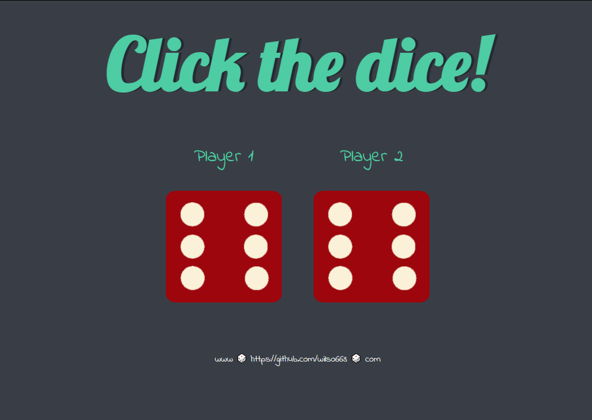

# Angela Yu Web Development Course - Dicee Javascript Challenge solution

This is a solution to the [Dicee Game Javascript exercise chapter by Angela Yu](https://www.udemy.com/course/the-complete-web-development-bootcamp). 

## Table of contents

- [Overview](#overview)
  - [The challenge](#the-challenge)
  - [Screenshot](#screenshot)
  - [Links](#links)
- [My process](#my-process)
  - [Built with](#built-with)
  - [What I learned](#what-i-learned)
  - [Continued development](#continued-development)
  - [Useful resources](#useful-resources)
- [Author](#author)

## Overview

### The challenge

Users should be able to:
- Click either dice on screen to update the image to a new random die and display a winner of the highest roll for Player 1 or Player 2.
- View the optimal layout depending on their device's screen size

### Screenshot




### Links

- Solution URL: [https://github.com/wilso663/dicee-challenge-exercise](https://github.com/wilso663/dicee-challenge-exercise)
- Live Site URL: [https://festive-payne-1cd204.netlify.app/](https://festive-payne-1cd204.netlify.app/)

## My process

### Built with

- CSS 3, Vanilla JS
- Desktop-first workflow

### What I learned

The most helpful thing that I learned was slicing from the end of the string backwards, allowing me to parse a character just before the ".png" portion of the image file name:
```javascript
  let dieFaceNumber = parseInt(imgSrc.slice(-5,-4));
  randomDieFace = Math.floor(Math.random() * 6) + 1;
  let dieFaceSource = "images/dice" + randomDieFace + ".png";
```
I could then inject a new random die face image by simply converting a random number, from 1 to 6, into the image source.


This portion wasn't new, but I prefer this practice to always using the document.getElementByID that I almost always see in references or tutorials for beginner javascript.
```javascript  
  var img = document.getElementsByClassName(className)[0];
```


### Continued development

As this is a small project intended as an exercise, additional development is entirely up to adding new features. Since the mobile and desktop layouts look and function as intended, this release is intended to be final.

### Useful resources

- [MDN Web Docs](https://developer.mozilla.org/en-US/docs/Web/JavaScript/Reference/Global_Objects/String/slice) - The official documentation for Mozilla development was helpful in referencing some functionality for the slice function. I used the code line illustrated above in the "What I Learned" section to parse the image source line for the image dice number, retrieved as an integer. This was used to update the image source by simply changing the parsed number from 1 to 6 programmatically.

- [Stackoverflow](https://stackoverflow.com/questions/20054889/button-onclick-function-firing-twice) - I used stackoverflow to diagnose a bug that occurred due to me binding the onclick method diceRoll twice, once in the html img element and again in the event binding line in index.js at lines 50 and 51.

## Author

- Website - [Stephen Wilson](https://github.com/wilso663)
- Frontend Mentor - [@wilso663](https://www.frontendmentor.io/profile/wilso663)


